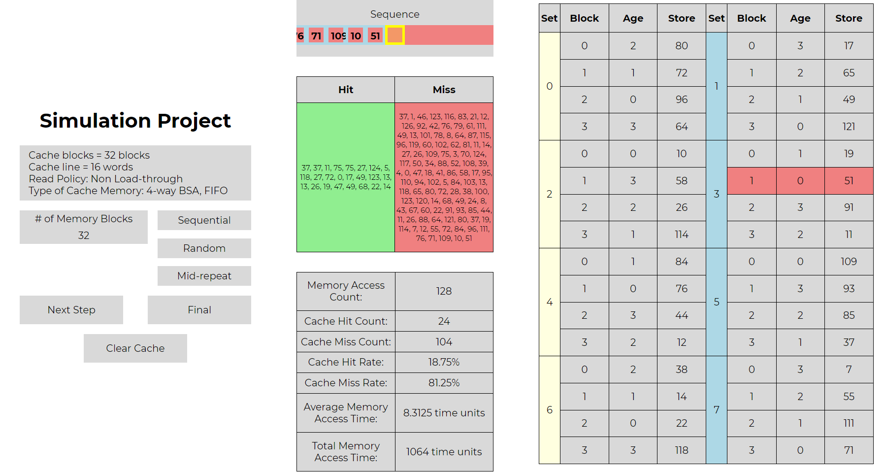

https://masterslyer10.github.io/CSARCH2_Sim_Project/

# Cache Simulation System
This repository contains a cache simulation system implemented in JavaScript. The system is designed to simulate the behavior of a cache memory with a 4-way set-associative (4-way BSA) architecture.The cache simulation system includes functions for initializing the cache, simulating cache behavior, updating cache values, and calculating cache hit rate, cache miss rate, average memory access time, and total memory access time. The cache is represented as a 8 x 4 array, with each block in the cache having properties such as validity, age, and tag.
The system also includes a graphical user interface (GUI) for interacting with the cache simulation, such as buttons for running the simulation, clearing the cache, and updating the cache values.

## Cache Specifications

- **Cache Organization:** 8 sets, each containing 4 blocks (4 x 8).
- **Replacement Policy:** FIFO (First In, First Out).
- **Read Policy:** Non load-through.

## Running the Simulation

1. Open `index.html` in a web browser.
2. Use the "Sequential Sequence," "Random Sequence," and "Mid-Repeat Blocks" buttons to generate sequences.
3. Use the "Run Step" and "Run Final" buttons to simulate the cache behavior.
4. View the results in the browser console.

The simulation calculates the following metrics:

- Memory Access Count
- Cache Hit Count
- Cache Miss Count
- Cache Hit Rate
- Cache Miss Rate
- Average Memory Access Time
- Total Memory Access Time

These metrics provide insights into the cache's performance and efficiency under different access patterns.

## Test Case Analysis

### a) Sequential Sequence

The system generates a sequential sequence of memory blocks up to 2n cache blocks and repeats the sequence four times. The JavaScript function generateSequentialSequence(numberOfMemoryBlocks) accomplishes this by creating a sequence that repeats 4 times and contains numbers from 0 to 2n-1.

### b) Random Sequence
Given n = 32 which is the size of our cache, we are able to generate up to 128 memory accesses with randomized numbers. Due to the randomness of the sequence, the performance of the cache is not that predictable. As such the caclulation will differ from test case to test case. In this particular run we were able to achive a Hit Rate of 18.75%, with an average access time of 8.3125.

### c) Mid-Repeat Blocks

The "Mid-Repeat Blocks" sequence in the cache simulation system is designed to follow a specific pattern. Here's a simplified explanation of how the sequence is generated:
1. The sequence is created to repeat four times and contains 2n cache blocks.
2. When generating the sequence, the code checks if the current index is neither equal to 0 nor equal to numberOfMemoryBlocks - 1.
3. If the condition is met, the sequence of numbers from 1 to numberOfMemoryBlocks - 2 is added twice.
4. After this mid-section, the sequence continues up to 2n and repeats the sequence four times.
The cache simulation system also includes functions for simulating cache behavior, updating cache values, and calculating statistics such as cache hit rate, cache miss rate, average memory access time, and total memory access time. The cache is represented as a 4 x 8 array, with each block having properties such as validity, age, and tag.

